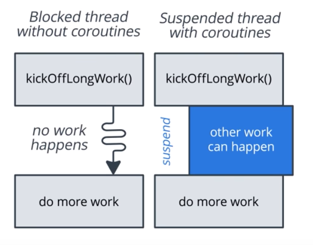

## Coroutines:

https://codelabs.developers.google.com/codelabs/kotlin-coroutines/#0

- Asynchronous
    > runs independently from main executoion (or main thread)

    > unless we wait for an answer, another work can continue that does not depend on answer wen it comes back.

- Non-blocking
  >not blocking main thread (or UI thread).

  >*If blocking, means, no other work can happen.*

  >Non-Blocking => it suspends, meaning other work can happen.

- Sequential
    > using Suspend functions, makes async code sequential

    > keyword ```suspend``` is kotlins way of making a function available to coroutines.

  >

  >instead of blocking untill the function returns, it suspends the function, untill the result is ready to resume where it left off.

  >when suspended, it unblocks the thread its running on, so other functions/coroutines can run.

  >suspend funcs can run on background thread or main thread

Because Coroutines code is compiled from sequential code, we dont have to specify call backs. Compiler will make sure the results of the coroutine are available before resuming.

#### To Use Coroutines, we need

- Job
    > Job is anything that can be cancelled.

    > All coroutines have a Job, and Job can be used to cancel the coroutines.

    > Job can be arranged as parent-child hierarchy. Cancelling a Parent means cancelling all its children.

- Dispatcher
    > sends off coroutines to run on various threads.
        
    > Example: Dispatcher.main will run on main thread, Dispatcher .io will run on IO thread.

- Scope
    > Scope combines information, including a job and dispatcher, to define the context in which the coroutine runs.

    >Scope keeps track of coroutines.

    >When a coroutine is launched, its in a scope.


 
#### Few points:
- @WorkerThread annotation, this function cannot be called on the main thread without causing an error.
-  annotated with @UiThread, it must run fast enough to execute on the main thread. That means, it needs to return very quickly, so that the next screen update is not delayed. 

#### CoroutineScope
- In Kotlin, all coroutines run inside a CoroutineScope. 
- A scope controls the lifetime of coroutines through its job. 
- When you cancel the job of a scope, it cancels all coroutines started in that scope. 
    - On Android, you can use a scope to cancel all running coroutines when, for example, the user navigates away from an Activity or Fragment. 
- Scopes also allow you to specify a default dispatcher. 
- A dispatcher controls which thread runs a coroutine.
  - a coroutine can switch dispatchers any time after it's started. For example, a coroutine can start on the main dispatcher then use another dispatcher to parse a large JSON result off the main thread.

#### CoroutineContext

- A CoroutineScope can take a CoroutineContext as a parameter. 
- The CoroutineContext is a set of attributes that configures the coroutine. It can define the threading policy, exception handler, etc.

#### Cancelling
```
private val viewModelJob = Job()
private val uiScope = CoroutineScope(Dispatchers.Main + viewModelJob)
```

```onCleared``` is called when the ViewModel is no longer used and will be destroyed.

If we wanted to cancel the scope, you'd have to include the following code:
```
override fun onCleared() {
    super.onCleared()
    viewModelJob.cancel()
}
```
Since viewModelJob is passed as the job to uiScope, when viewModelJob is cancelled every coroutine started by uiScope will be cancelled as well. 

It's important to cancel any coroutines that are no longer required to avoid unnecessary work and memory leaks.

- You must pass CoroutineScope a Job in order to cancel all coroutines started in the scope. 
    - If you don't, the scope will run until your app is terminated. If that's not what you intended, you will be leaking memory.
- Scopes created with the CoroutineScope constructor add an implicit job, which you can cancel using uiScope.coroutineContext.cancel()

#### ViewModelScope

To avoid writing above boilerplate code (**Cancelling**) in every ViewModel, use AndroidX implementation ```"androidx.lifecycle:lifecycle-viewmodel-ktx:x.x.x"``` library in the gradle.

- This library adds a viewModelScope as an extension function of the ViewModel class. 
- This scope is bound to Dispatchers.Main and will automatically be cancelled when the ViewModel is cleared. 
- Instead of having to create a new scope in every ViewModel, you can just use viewModelScope and the library will take care of setting up and clearing the scope for you.

#### How to use viewModelScope to launch a coroutine that will make a network request in a background thread ?
```
class MainViewModel : ViewModel() {
    // Make a network request without blocking the UI thread
    private fun makeNetworkRequest() {
       // launch a coroutine in viewModelScope 
        viewModelScope.launch(Dispatchers.IO) {
            // slowFetch()
        }
    }
    // No need to override onCleared()
}

fun onMainViewClicked() {
   // launch a coroutine in viewModelScope
   viewModelScope.launch {
       // suspend this coroutine for one second
       delay(1_000)
       // resume in the main dispatcher
       // _snackbar.value can be called directly from main thread
       _snackBar.value = "Hello, from coroutines!"
   }
}
```
- viewModelScope.launch will start a coroutine in the viewModelScope.
    - This means when the job that we passed to viewModelScope gets canceled, all coroutines in this job/scope will be cancelled. 
    - If the user left the Activity before delay returned, this coroutine will automatically be cancelled when onCleared is called upon destruction of the ViewModel.
- Since viewModelScope has a default dispatcher of Dispatchers.Main, this coroutine will be launched in the main thread.
- The function delay is a suspend function.

#### suspendCoroutine

- Kotlin provides a function suspendCoroutine that's used to convert callback-based APIs to suspend functions.

- Calling suspendCoroutine will immediately suspend the current coroutine. 

- suspendCoroutine will give you a ```continuation object``` that you can use to resume the coroutine.

    -  A continuation does what it sounds like: 
        - it holds all the context needed to continue, or resume, a suspended coroutine.

        - The continuation that suspendCoroutine provides has two functions: 
            - resume and 
            - resumeWithException. 
        
            Calling either function will cause suspendCoroutine to resume immediately.

