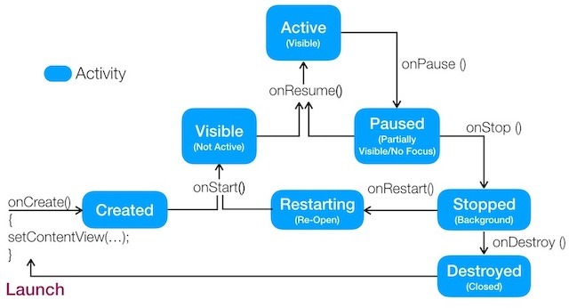
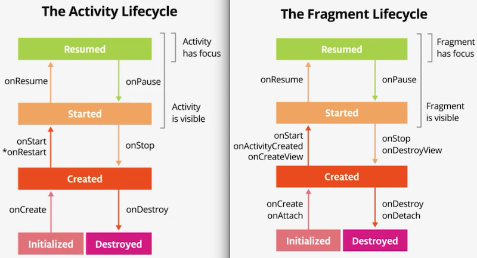
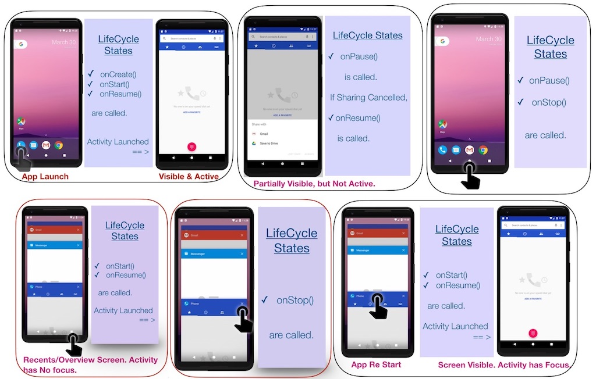

# LifeCycle States of Activity

In Mainfest, play with, android:launchMode. You will see different behaviour.

https://www.androidcitizen.com/activity-lifecycle/

[Cheat Sheet](https://medium.com/androiddevelopers/the-android-lifecycle-cheat-sheet-part-i-single-activities-e49fd3d202ab)

## Lifecycle States

<figure>
   

  <figcaption>Activity/Fragment Lifecycle. Source - <a href="http://udacity.com">Udacity</a></figcaption>
</figure>

### Activity Lifecycle

#### onCreate()
- fires when the system first creates the activity.
- perform basic application startup logic that should happen only once for the entire life of the activity.

#### onStart()
- fires when the activity enters the Started state.
-  makes the activity visible (but not active) to the user 
    - app prepares for the activity to enter the foreground and become interactive.
    - this method is where the app initializes the code that maintains the UI.

#### onResume()
- fires when the activity enters the Resumed state.  
- app becomes interactive  
    - The app stays in this state until something happens to take focus away from the app. Such an event might be, for instance, receiving a phone call, the user’s navigating to another activity, or the device screen’s turning off. 

#### onPause()
- The system calls this method as the first indication that the user is leaving your activity *(though it does not always mean the activity is being destroyed)* 
- it indicates that the activity is no longer in the foreground *(though it may still be visible if the user is in multi-window mode)*

#### onStop()
- activity is no longer visible to the user.
for example
    - when a newly launched activity covers the entire screen. 
    - when the activity has finished running, and is about to be terminated.

#### onDestroy()
- is called before the activity is destroyed.

## Different States while Navigating App

<figure>
   

  <figcaption>Activity/Fragment Lifecycle. Source - <a href="http://udacity.com">Udacity</a></figcaption>
</figure>

### Fragments Lifecycle

[Cheat Sheet](https://medium.com/androiddevelopers/the-android-lifecycle-cheat-sheet-part-iii-fragments-afc87d4f37fd)

#### onAttach()
- Called when the fragment has been associated with the activity (the Activity is passed in here).

#### onCreate()
- system calls this when creating the fragment. 
    -  initialize essential components of the fragment that you want to retain when the fragment is paused or stopped.
#### onCreateView()
- system calls this when it's time for the fragment to draw its user interface for the first time.    
- create the view hierarchy associated with the fragment.

#### onActivityCreated()
- Called when the activity's onCreate() method has returned.

#### onResume()
- The fragment is visible in the running activity.

#### onPause()
- system calls this method as the first indication that the user is leaving the fragment. (persistance done here) 
- fragment partially visible (but no focus)
    - (the foreground activity is partially transparent or doesn't cover the entire screen).

#### onStop()
The fragment isn't visible. Either the host activity has been stopped or the fragment has been removed from the activity but added to the back stack. A stopped fragment is still alive (all state and member information is retained by the system). However, it is no longer visible to the user and is killed if the activity is killed.

#### onDestroyView()
- Called when the view hierarchy associated with the fragment is being removed.
#### onDetach()
- Called when the fragment is being disassociated from the activity.
