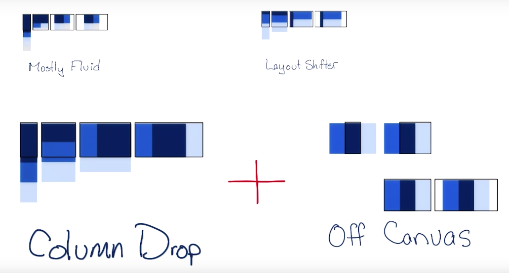
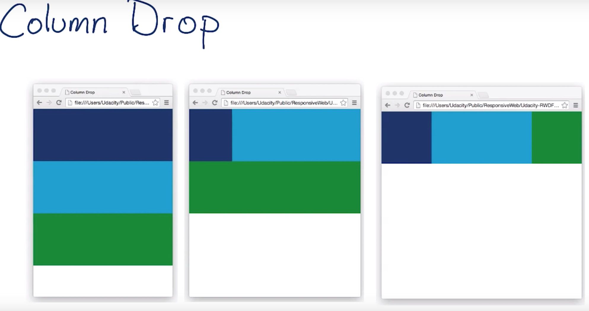
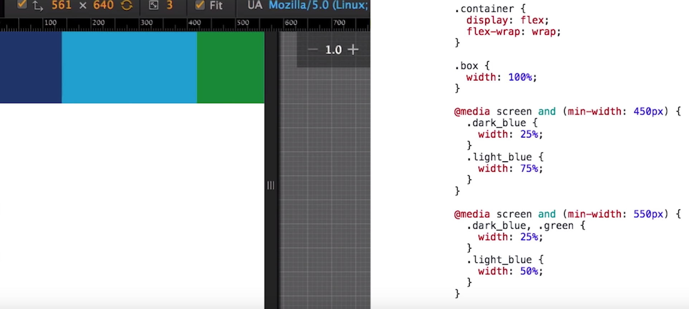

# Notes

favicon.ico for icon.

### HTML

Image tags are different from most other elements in that they do not wrap other elements, but instead refer to a resource. When the browser encounters an  tag, it draws the image to the page. This is known as a replaced element. Other replaced elements include embedded documents and applets.
Because they do not wrap content or other elements,  tags do not have a corresponding closing tag. This makes them self-closing tags (also known as void tags).

### CSS - Cascading Style Sheets

Css starts with a rule set, which has 2 parts. (1. Selector 2. Declaration Block)

Ex: 
	
	div {
		text-align: right;
	} 
     
    Selector -> div is a HTML element that needs to be Styled, and So, Div is Selector.

    text-align: right -> is Declaration Block (written inside curly braces 
                      -> which is the code that describes the styles you want to apply.

> <head> is used for putting the meta data of the site. Style is one of the information that goes in <head> element. Anything that goes inside  is CSS.

	/* add CSS here */ is a CSS comment.
	
	<!-- This is a comment --> is a HTML comment.

In order to style all the paragraphs, p { color: red } will be enough.

In order to select only particular paragraphs, html elements can be given attributes id or class.

One element can have only 1 id attribute, and multiple elements can not have same id.

Whereas class attribute, multiple elements can have same class name. (one element can have multiple class names seperated by spaces).

so for sytling, .class-name { } or #id-name { } can be used to apply css on multiple elements.

**Color:**

body {
	background-color: rgb(255,0,255);
}

or backgorund-color: #ff00ff;

font-family: Helvetica, Arial, sans-serif;  (If Helvetica is not available on a platform, it tries to render Arial and so on)
font-weight : bold;
text-transform: uppercase;
text-decoration:underline;

**Positional Selectors:**

https://css-tricks.com/how-css-selectors-work/

:nth-child(2) {

}

**Style Sheet:**

What if you wanted to use the same CSS on more than one webpage?

CSS lives in a different file.

define your stye in style-sheet-name.css file and link in head. <link rel="stylesheet" href="style-sheet-name.css">

CSS allows content to overflow its containter. i.e, if image is bigger than container, image would overflow.

catch all (?) for image in css 

img, embed, 
object, video {
   max-width: 100%;
	}
}

**normalize.css** 
 - helps the CSS you write display consistently across browsers. 
 - available freely
 - Go to cdnjs.com/libraries/normalize and find the version of the file ending with .min.css
 (All browsers come with a set of default styles, but the defaults are different from browser to browser. normalize.css gives you a good starting point for developing your own custom CSS for a website or web app)

a[href]{
  /* style declaration */
}
This selector would match any anchor element with an href attribute. 

a[href="#"]{
  /* style declaration */
}
This selector would match only those anchor elements whose href attribute has a value of #.

body span {
  /* style declarations */
}
it targets any span descended from a body

similary, 
body .thumbnail-title {
  /* style declarations */
}

Child selector syntax uses the combinator >

Child selectors target elements of a specified type that are the immediate children of another specified element.

li > span {
  /* style declarations */
}
Reading from right to left, this selector targets any span that is the immediate child of a li element 

Sibling selector syntax uses the combinator ~.
this syntax targets elements with the same parent. However, because of the directional nature of relationship selectors, the results might not be exactly as you expect.

header ~ ul {
  /* style declarations */
}
This selector targets any ul that is preceded by a header with the same parent element.
Reversing the syntax (ul ~ header) would result in no elements being selected, because there is no header preceded by a sibling ul.

Adjacent sibling combinator is +, which targets elements that are immediately preceded by a sibling of the specified type. 

li + li {
  /* style declarations */
}
This syntax would select all li elements immediately preceded by a sibling li.

### Responsive

**Flexbox**

One of the tool to build layouts.

So powerful coz, it Fills the space thats available. 

If an element has extra space around it, it wil expand to fit or if its getting crowded elements shrink so that they take up as little space as possible.

flex-container: by default, flex elements fit on a single line. (doesnt matter with the width of the element thats set, they wont wrap). Browser will size them to fit within the viewport. This can be changed with flex-wrap: wrap property

order attribute: can change the order of the element.

**Grids**

With Grids fluid system, columns end up wrapping to the next line as browser width start getting smaller.

**Media Queries:**

Few ways to selectively apply different CSS styles for different screen sizes.

Media Query is one of the way. 

Media Queries provides easy logic to apply different styles depending on device characteristics (like width, height, pixel ratio.). Logic like changing everything form background images to restructuring site layout.

For adding responsive style, just add media query to additional style sheet.

Ex: (Linked CSS)
><link rel="stylesheet" media="screen and (min-width: 300px)" href="over300.css"> 

other way is @media and @import .

Ex:
@media screen and (min-width: 500px) {
	body {background-color: green}
}

@import: performance costly.
Linked CSS: many small files but many http requests.
@media: big files and fewer http requests.

Breakpoint: point at which the page changes its layout is called breakpoint, and depending on how yout page is layed out you might have one or several breakpoints.

Breakpoints are decided based on the content (start with small size screen, and single column)

font-boosting ?

viewport:
><meta name="viewport" content="width=device-width,initial-scale=1">

https://developer.mozilla.org/en-US/docs/Mozilla/Mobile/Viewport_meta_tag

### Responsive Patterns

1. Mostly fluid
2. Layout Shifter
3. Column Drop
4. Off Canvas

**Column Drop**

At its narrowest viewport, it Stacks elements vertically.

**Mostly fluid**

