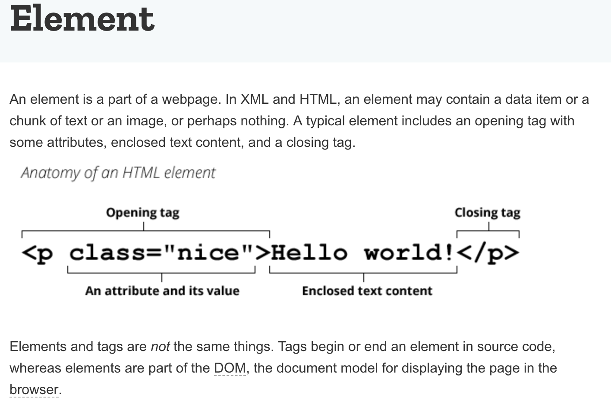
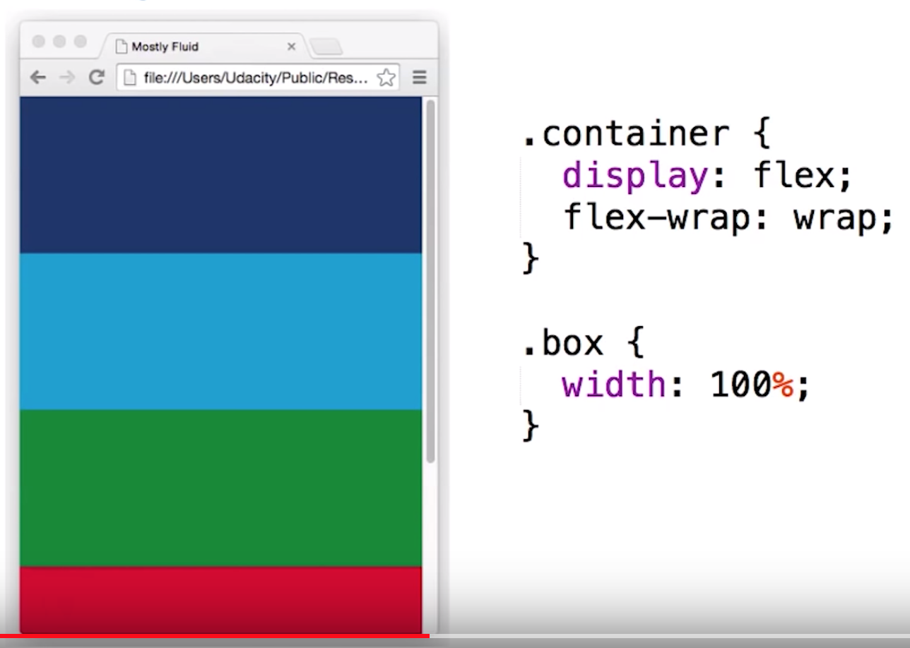
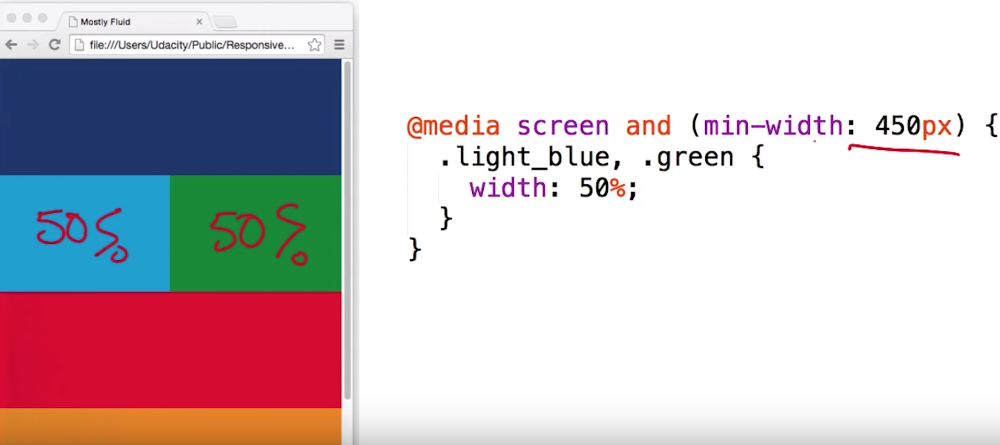
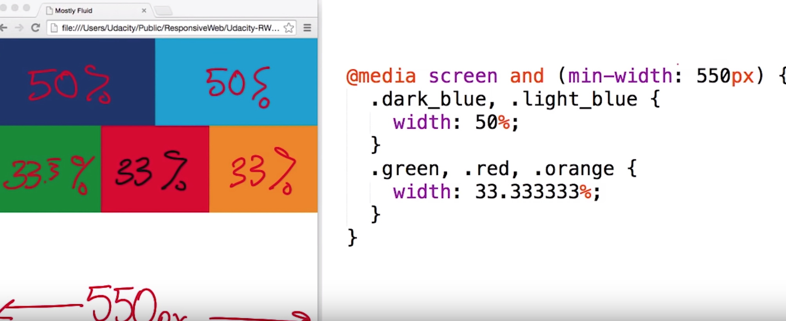
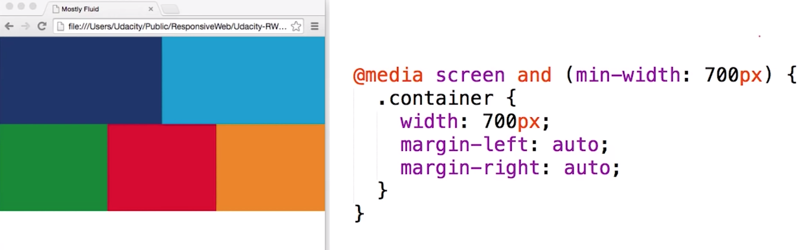
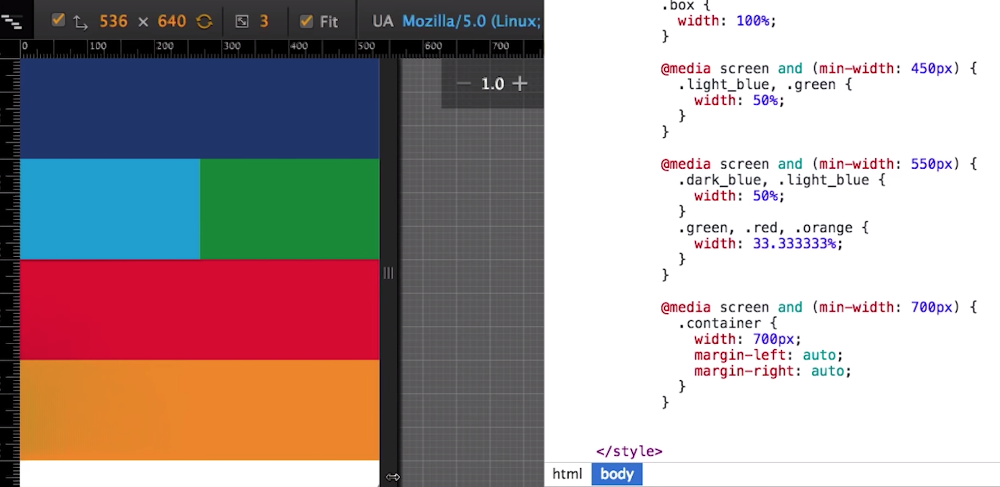
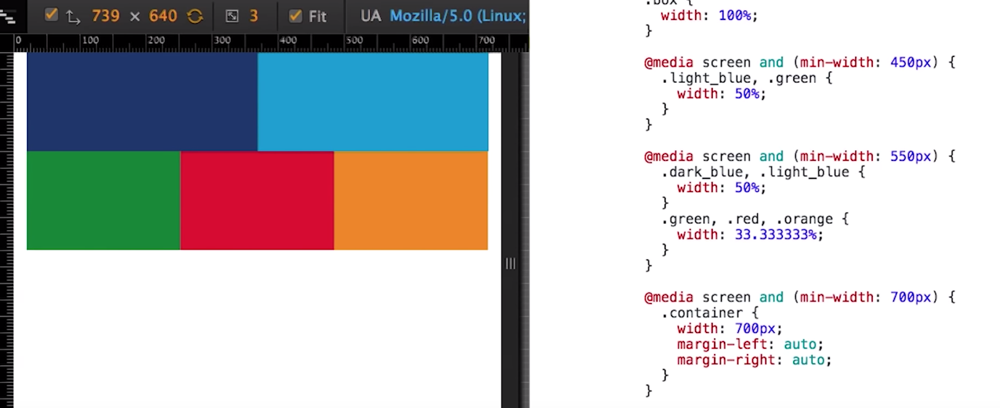
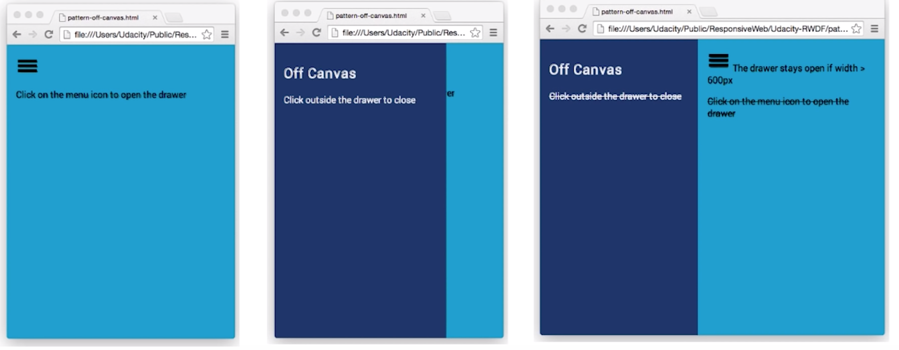

# Notes

favicon.ico for icon.

https://internetingishard.com

## **HTML**



>Elements in HTML have attributes.<br>
Attributes are additional values that configure the elements or adjust their behavior in various ways to meet the criteria the users want.

>The class global attribute is a space-separated list of the classes of the element. Classes allow CSS and Javascript to select and access specific elements via the class selectors or functions like the DOM method document.getElementsByClassName.

Image tags are different from most other elements in that they do not wrap other elements, but instead refer to a resource. When the browser encounters an  tag, it draws the image to the page. This is known as a replaced element. Other replaced elements include embedded documents and applets.
Because they do not wrap content or other elements,  tags do not have a corresponding closing tag. This makes them self-closing tags (also known as void tags).

```
header: <header>

represents a group of introductory content. If it is a child of <body> it defines the global header of a webpage, but if it's a child of an <article> or <section> it defines a specific header for that section (try not to confuse this with titles and headings).
```
```
navigation bar: <nav>

contains the main navigation functionality for the page. Secondary links, etc., would not go in the navigation.
```
```
main content: <main>, with various content subsections represented by <article>, <section>, and <div> elements.

<main> is for content unique to this page. Use <main> only once per page, and put it directly inside <body>. Ideally this shouldn't be nested within other elements.

<article> encloses a block of related content that makes sense on its own without the rest of the page (e.g., a single blog post).

<section> is similar to <article>, but it is more for grouping together a single part of the page that constitutes one single piece of functionality (e.g., a mini map, or a set of article headlines and summaries). It's considered best practice to begin each section with a heading; also note that you can break <article>s up into different <section>s, or <section>s up into different <article>s, depending on the context.

(<div>) is the generic container for flow content. It has no effect on the content or layout until styled using CSS. It is a block level non-semantic element, which you should only use if you can't think of a better semantic block element to use, or don't want to add any specific meaning. 

<span> is an inline non-semantic element, which you should only use if you can't think of a better semantic text element to wrap your content, or don't want to add any specific meaning. 

```
```
sidebar: <aside>; often placed inside <main>

contains content that is not directly related to the main content but can provide additional information indirectly related to it (glossary entries, author biography, related links, etc.).
```
```
footer: <footer>

represents a group of end content for a page.
```

## **CSS - Cascading Style Sheets**

Css starts with a rule set, which has 2 parts. (1. Selector 2. Declaration Block)

Ex: 
	
	div {
    
      text-align: right;

      background-color: red  (here last ; for a declaration is not 
      mandatory)
	} 
     
    Selector -> div is a HTML element that needs to be Styled, and So, Div is Selector.

    A property and value pair is called a declaration.
    
    text-align: right -> is Declaration Block (written inside curly braces 
                      -> which is the code that describes the styles you want to apply.

CSS syntax building blocks are:

The **property** which is an identifier, that defines which feature is considered.

The **value** which describe how the feature must be handled by the engine. Each property has a set of valid values.

> <head> is used for putting the meta data of the site. Style is one of the information that goes in <head> element. Anything that goes inside <style></style> is CSS.

	/* add CSS here */ is a CSS comment.
	
	<!-- This is a comment --> is a HTML comment.

In order to style all the paragraphs, p { color: red } will be enough.

In order to select only particular paragraphs, html elements can be given attributes id or class.

One element can have only 1 id attribute, and multiple elements can not have same id.

Whereas class attribute, multiple elements can have same class name. (one element can have multiple class names seperated by spaces).

so for sytling, .class-name { } or #id-name { } can be used to apply css on multiple elements.

**Color:**

body {
	background-color: rgb(255,0,255);
}

or backgorund-color: #ff00ff;

font-family: Helvetica, Arial, sans-serif;  (If Helvetica is not available on a platform, it tries to render Arial and so on)
font-weight : bold;
text-transform: uppercase;
text-decoration:underline;

**Positional Selectors:**

https://css-tricks.com/how-css-selectors-work/

:nth-child(2) {

}

**Style Sheet:**

What if you wanted to use the same CSS on more than one webpage?

CSS lives in a different file.

define your stye in style-sheet-name.css file and link in head. <link rel="stylesheet" href="style-sheet-name.css">

(<link>) specifies relationships between the current document and an external resource (like .css files).

CSS allows content to overflow its containter. i.e, if image is bigger than container, image would overflow.

catch all (?) for image in css 

img, embed, 
object, video {
   max-width: 100%;
	}
}

**normalize.css** 
 - helps the CSS you write display consistently across browsers. 
 - available freely
 - Go to cdnjs.com/libraries/normalize and find the version of the file ending with .min.css
 (All browsers come with a set of default styles, but the defaults are different from browser to browser. normalize.css gives you a good starting point for developing your own custom CSS for a website or web app)

a[href]{
  /* style declaration */
}
This selector would match any anchor element with an href attribute. 

a[href="#"]{
  /* style declaration */
}
This selector would match only those anchor elements whose href attribute has a value of #.

body span {
  /* style declarations */
}
it targets any span descended from a body

similary, 
body .thumbnail-title {
  /* style declarations */
}

Child selector syntax uses the combinator >

Child selectors target elements of a specified type that are the immediate children of another specified element.

li > span {
  /* style declarations */
}
Reading from right to left, this selector targets any span that is the immediate child of a li element 


Sibling selector syntax uses the combinator ~.
this syntax targets elements with the same parent. However, because of the directional nature of relationship selectors, the results might not be exactly as you expect.

header ~ ul {
  /* style declarations */
}
This selector targets any ul that is preceded by a header with the same parent element.
Reversing the syntax (ul ~ header) would result in no elements being selected, because there is no header preceded by a sibling ul.

Adjacent sibling combinator is +, which targets elements that are immediately preceded by a sibling of the specified type. 

li + li {
  /* style declarations */
}
This syntax would select all li elements immediately preceded by a sibling li.


## **Responsive**

Changing the image (proportions, cropping, replacing) is usually referred to as art direction.

**Flexbox**

One of the tool to build layouts.

So powerful coz, it Fills the space thats available. 

If an element has extra space around it, it wil expand to fit or if its getting crowded elements shrink so that they take up as little space as possible.

flex-container: by default, flex elements fit on a single line. (doesnt matter with the width of the element thats set, they wont wrap). Browser will size them to fit within the viewport. This can be changed with flex-wrap: wrap property

order attribute: can change the order of the element.

**Grids**

With Grids fluid system, columns end up wrapping to the next line as browser width start getting smaller.

**Media Queries:**

Few ways to selectively apply different CSS styles for different screen sizes.

Media Query is one of the way. 

Media Queries provides easy logic to apply different styles depending on device characteristics (like width, height, pixel ratio.). Logic like changing everything form background images to restructuring site layout.

For adding responsive style, just add media query to additional style sheet.

Sometimes you may want to create a media query that depends on multiple conditions. This is where the logical operators come in: not, and, and only.

**Combining multiple types or featuresSection:**

The **and** keyword combines a media feature with a media type or other media features. This example combines two media features to restrict styles to landscape-oriented devices with a width of at least 30 ems:

@media (min-width: 30em) and (orientation: landscape) { ... }

To limit the styles to devices with a screen, you can chain the media features to the screen media type:

@media screen and (min-width: 30em) and (orientation: landscape) { ... }

**Ex: (Linked CSS)**
><link rel="stylesheet" media="screen and (min-width: 300px)" href="over300.css"> 

other way is @media and @import.

Ex:
@media screen and (min-width: 500px) {
	body {background-color: green}
}

@import: performance costly.
Linked CSS: many small files but many http requests.
@media: big files and fewer http requests.

Breakpoint: point at which the page changes its layout is called breakpoint, and depending on how yout page is layed out you might have one or several breakpoints.

Breakpoints are decided based on the content (start with small size screen, and single column)

You can use a comma-separated list to apply styles when the user's device matches any one of various media types, features, or states. For instance, the following rule will apply its styles if the user's device has either a minimum height of 680px **or** is a screen device in portrait mode:

@media (min-height: 680px), screen and (orientation: portrait) { ... }

Taking the above example, if the user had a printer with a page height of 800px, the media statement would return true because the first query would apply. Likewise, if the user were on a smartphone in portrait mode with a viewport height of 480px, the second query would apply and the media statement would still return true.

The **not** keyword inverts the meaning of an entire media query. It will only negate the specific media query it is applied to. (Thus, it will not apply to every media query in a comma-separated list of media queries.) The not keyword can't be used to negate an individual feature query, only an entire media query. The not is evaluated last in the following query:

@media not all and (monochrome) { ... }

 so that the above query is evaluated like this:

@media not (all and (monochrome)) { ... }

**Improving compatibility with older browsersSection**

The **only** keyword prevents older browsers that do not support media queries with media features from applying the given styles. It has no effect on modern browsers.

@media only screen and (color) { ... }

font-boosting ?

viewport:
><meta name="viewport" content="width=device-width,initial-scale=1">

https://developer.mozilla.org/en-US/docs/Mozilla/Mobile/Viewport_meta_tag

## Flexbox

https://css-tricks.com/snippets/css/a-guide-to-flexbox/

## **Responsive Patterns**


1. Mostly fluid
2. Layout Shifter
3. Column Drop
4. Off Canvas

### **Column Drop**

At its narrowest viewport, it Stacks elements vertically.


### **Mostly Fluid**

More like Grid type, with different columns and columns fitting in different ways.














### **Layout Shifter**

probably most responsive.

instead of re-flowing / dropping below other columns, 
here, we can use **order** CSS attribute.

### **Off Canvas**

instead of showing content stacked, it shows less frequently used content like Navigation, app menus off screen, Only showing if the screen is large enough.



```
<nav id="drawer" class="dark_blue">
</nav>

<main class="light_blue">
</main>
```

to make sure elements take full view-port width
```
html, body, main {
  height: 100%;
  width: 100%
}
```

```
nav {
  width: 300px;
  height: 100%;
  position: absolute;
  -webkit-transform: translate (-300px, 0);
  transform: translate(-300px, 0);
  transition: transform 0.3s ease;
}
```

when to open the navigation

```
nav.open {
  -webkit-transform: translate (0, 0);
  transform: translate(0,0);
}
```

breakpoint at 600px,
```
@media screen and (min-width: 600px) {
  nav {
    position: relative;
    transform: translate(0,0);
  }

  body {
    display: flex;
    flex-flow: row nowrap;
  }

  main {
    width: auto;
    flex-grow: 1; 
    
    //flex-grow: 1 => allows element to grow and take the full remaining width of the view port.
  }
}
```
### **Responsive Tables**

tables (with multiple columns) will overflow on a small screen

to fix this there are many methods, 3 of which are

1. Hidden Columns
2. No more tables
3. Contained tables

#### Hidden Columns
>Hides Columns based on importance as viewports size gets smaller.

#### No more tables
>Table is collapsed and resembles a long list (instead of tables). Advantage here is all of the data is visible irrespective of view-port size.

this will change the table to display as list when the view port size is less than 500px.
```
 @media screen and (max-width: 500px) {
        table, thead, tbody, th, td, tr {
          display: block;
        }
        thead tr { 
          // to hide the table header
          position: absolute;
          top: -9999px;
          left: -9999px;
        }

        td { 
          // make room for header
          position: relative;
          padding-left: 50%; 
        }
        
        td:before { 
          position: absolute;
          left: 6px;
          content: attr(data-th);
          font-weight: bold;
        }
        td:first-of-type {
          font-weight: bold;
        }
      }
```

#### Contained Table

Instead of breaking out of the view port, Table will instead take up the same width, but scroll within the view port. 

Wrap the table in div (with class name) and in CSS set the attributes (of div class) of width to 100% and overflow-x: auto;

```
div.tableName {
  width: 100%;
  overflow-x: auto;
}

<div class="tableName">
<table>
<thead> </thead>
<tbody> </tbody>
</table>
</div>
``` 

## Responsive Images

CMd + Shift + C (macOS) for Chrome Dev Tools.

Under Network, disable cache and see the type/load time. Also can change to 3G for debugging.

less pixels + better compression = less bytes

If you want to responsibly cover the Image to whole height of the view port,

you can set the height to 100% (but this works only if the height of HTML and body elements are also set to 100%).

A simple way is to use **vh** unit (called Viewport Height). Similary **vw** unit (called Viewport Width).

1 VH menas 1% of Viewport Height.

Another Usecase: If you want to resize image to fit smaller of the height or width of the viewport, **vmin** unit, viewport minimum, corresponds to 1% of viewport widht/height, which ever is smaller.

Usecase: If you want to cover the whole viewport without stretching/squashing, **vmax** unit can be used, which corresponds to 1% of the viewport width/height, which ever is greater.

### Raster and Vector

Raster is individual dots of color, photographs/images-> comes from camera.

Vector - logos, created by programs like Adobe. They are defined as geometry of image from curves/lines/color.

Grunt tool for shrinking/compressing images.

https://classroom.udacity.com/courses/ud882/lessons/3520939843/concepts/37681789440923

### Images with Markup

background-image: cover => image kept just as small as possible, so that its smallest dimension matches its containers smallest dimension.

background-image: contain => image will be completely visible (for this one of its dimensions will be smaller than containers dimensions.)

#### Symbol characters

https://unicode-table.com/en/sets/

https://youtu.be/Ne-kAmJX9zM

2 ways to reduce http requests for images, is inlining the images.
1. SVG
2. DataURI

## Full Responsiveness

How to serve the right image for every combination of display capability and display size ?

media queries work in a way, but it is difficult to debug.

media queries is like, guess what image will be best at run time  which is forcing image choice on the browser, rather than giving the information to the browser so that it will make best choice.

other problem with media queries is they refer to the viewport and not the actual size of the image.

To do it properly, CSS need to be written to handle different use cases.

**srcset=** attribute, allows to mention more than 1 image link. Browser will choose the image based on the resolution of the display.

https://youtu.be/h7H-t5ZV7YY

Ex:
```

```
[Hero Images](https://cloudfour.com/thinks/responsive-hero-images/)